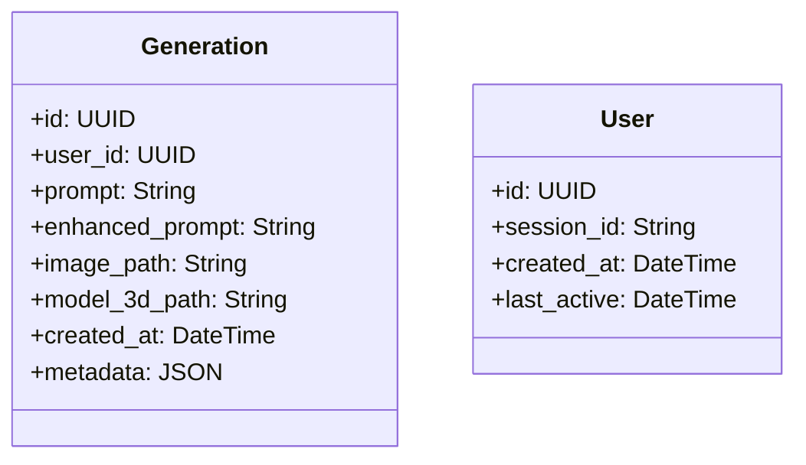

# AI-Powered Text-to-3D Generation System
## Product Requirements Document

## 1. Overview
An intelligent pipeline that transforms natural language descriptions into 3D models through AI-powered text-to-image and image-to-3D conversion.

## 2. Problem Statement
Content creators, game developers, and designers need a streamlined way to generate 3D assets from textual descriptions, reducing the time and expertise required for 3D modeling.

## 3. Goals & Objectives
- Enable users to generate 3D models from natural language descriptions
- Provide high-quality, usable 3D assets
- Maintain context and memory of previous generations
- Create an intuitive user experience

## 4. User Stories
1. As a user, I want to input a text description and receive a 3D model
2. As a user, I want to refine my generations using natural language
3. As a user, I want to access my generation history
4. As a user, I want to download my generated 3D models

## 5. Technical Requirements

### 5.1 Core Components
1. **Local LLM Integration**
   - DeepSeek or Llama for prompt enhancement
   - Context window management
   - Response formatting

2. **Openfabric Integration**
   - Text-to-Image service
   - Image-to-3D conversion service
   - API client implementation

3. **Memory System**
   - SQLite database for persistence
   - Session management
   - Context recall

4. **API Layer**
   - RESTful endpoints
   - Request/response validation
   - Error handling

5. **User Interface**
   - Streamlit-based web interface
   - Input form
   - Result display
   - History view

### 5.2 Non-Functional Requirements
- **Performance**: <5s response time for generation
- **Scalability**: Support 100+ concurrent users
- **Security**: Secure API endpoints
- **Usability**: Intuitive interface requiring minimal instructions

## 6. Architecture

```
User Prompt
       ↓
Local LLM (Prompt Enhancement)
       ↓
Text-to-Image (Openfabric)
       ↓
Image-to-3D (Openfabric)
       ↓
3D Model Output
       ↓
Store in Memory
```

## 7. Data Model


## 8. API Specification

### POST /api/generate
- **Description**: Generate a 3D model from text
- **Request**:
  ```json
  {
    "prompt": "a glowing dragon standing on a cliff at sunset",
    "style": "realistic",
    "resolution": "1024x1024"
  }
  ```
- **Response**:
  ```json
  {
    "generation_id": "uuid",
    "status": "processing",
    "estimated_time": 30
  }
  ```

### GET /api/generations
- **Description**: Get generation history
- **Response**:
  ```json
  [
    {
      "id": "uuid",
      "prompt": "a glowing dragon...",
      "created_at": "2025-06-04T16:06:12Z",
      "status": "completed"
    }
  ]
  ```

## 9. Success Metrics
- Generation success rate (>95%)
- Average generation time (<30s)
- User retention rate
- Number of generations per user

## 10. Future Enhancements
- Support for animation
- Multi-model generation
- Collaborative features
- Marketplace for 3D assets

## 11. Open Questions
- What are the rate limits for Openfabric APIs?
- What are the storage requirements for 3D models?
- How to handle model failures gracefully?

## 12. Timeline
- Week 1: Setup & Core Pipeline
- Week 2: LLM Integration & Memory
- Week 3: API & UI Development
- Week 4: Testing & Deployment

---
*Last Updated: June 4, 2025*
